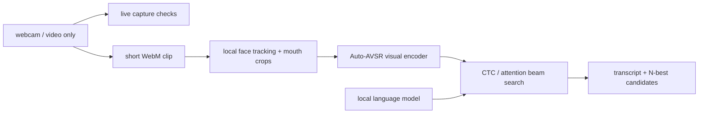

# unsaid

> type without speaking.


`unsaid` is a webcam-only visual speech demo. It records a short silent clip, runs an open-vocabulary Auto-AVSR model, and exposes several beam-search hypotheses instead of laundering uncertainty into one suspiciously confident sentence.

No microphone. No three-word training ritual. Local development keeps inference on the Mac; the public demo sends each silent clip to its inference server and deletes the temporary file immediately afterward.

## What changed

The first prototype trained a tiny landmark classifier on words such as `pat`, `bat`, and `mat`. It was visually fun and statistically useless: with little data, it could collapse onto one class. This version replaces that toy model with a pretrained visual-speech system and keeps the browser responsible for the things it does well:

- live face and mouth tracking with MediaPipe;
- measured capture quality from frame rate, light, face angle, and mouth size;
- video-only recording;
- a legible transcript and N-best candidate list.

The Python side owns mouth-crop extraction, the visual transformer, and beam search.

## Run on a Mac

Requirements: an Apple Silicon Mac, Node 20+, Python 3.12 via [`uv`](https://docs.astral.sh/uv/), and roughly 3 GB free for dependencies and model files.

```bash
git clone https://github.com/madebylukas/unsaid.git
cd unsaid
npm install
uv python install cpython-3.12-macos-aarch64
npm run setup:vsr
```

Then use two terminals:

```bash
npm run vsr
```

```bash
npm run dev
```

Open [http://127.0.0.1:5173](http://127.0.0.1:5173), enable the camera, mouth a short phrase, and stop. The first read is slower because the model loads lazily.

The interface starts with a constrained seven-phrase demo deck. A second six-line deck is available with `rotate set`; only the visible deck is decoded at once so the extra range does not dilute the match:

- `it's pretty cool you know`
- `hello how are you`
- `thank you very much`
- `i don't know`
- `see you tomorrow`
- `send the message`
- `lukas is really handsome`
- `please help me`
- `this is not a drill`
- `you look suspicious`
- `we have a problem`
- `meet me outside`
- `the wifi is down`

Mouth one visible line exactly. The raw visual beam is matched against the active deck and commits only when its match and separation clear the threshold; otherwise it says `not confident`. A committed phrase is highlighted directly in the deck. Switch to `open` in the interface for unrestricted decoding.

CPU is the reliable default because ESPnet's legacy beam search still mixes CPU tensors into MPS decoding. You can experiment with MPS, but it is not yet the honest default:

```bash
UNSAID_DEVICE=mps npm run vsr
```

## Architecture



In local development, the browser talks only to `127.0.0.1:8787`. In production, the browser uses the same-origin `/api` route. Clips are written to a temporary file for inference and deleted immediately afterward.

## Public deployment

The production image is defined in `Dockerfile.vercel`. It builds the Vite interface on top of a pinned model image in this project's Vercel Container Registry, then serves both the site and API from one origin. The server listens on Vercel's assigned `PORT`.

`Dockerfile.bootstrap` contains the full reproducible model build used to refresh that base image. Its checkpoints are converted into balanced state-dict shards: each stays inside VCR's per-layer limit and loads incrementally to keep inference below the Hobby plan's 2 GB memory ceiling. Normal code releases reuse the immutable base instead of downloading 1.2 GB again.

## Honest limits

Visual speech is underdetermined. `p`, `b`, and `m` can look the same because voicing and nasal airflow are not visible. A language model can rerank plausible readings; it cannot recover photons the camera never received.

This is a demo, not accessibility software and not a 99%-accurate Whisper replacement. The upstream checkpoint reports roughly 19% word error on the controlled LRS3 benchmark. Real webcams, unseen faces, bad light, facial hair, and casual mouthing are harder. The useful questions are whether the intended words survive in the top candidates, how often the system abstains, and how quickly personal corrections can improve it.

Read [RESEARCH.md](RESEARCH.md) for the evidence and [IDEATION.md](IDEATION.md) for the accuracy roadmap.

## Verification

```bash
npm test
npm run build
python3 -m py_compile backend/server.py
```

End-to-end browser validation on an M1 Pro used the built-in 1280×720 camera at 30 FPS. A 4.8-second cold clip decoded in 13.7 seconds; a 4.5-second warm clip decoded in 8.7 seconds. Both returned five distinct candidates. Treat those as one-machine measurements, not marketing scripture.

## Privacy

- The browser requests `audio: false`.
- Local inference stays on the Mac; the public demo sends the silent clip only to its same-origin inference container.
- Temporary clips are deleted after each request.
- No accounts, analytics, or third-party API calls exist at runtime.

Privacy claims should survive `rg`, not merely a tasteful black interface.

## Upstream work

The local inference bridge adapts [Chaplin](https://github.com/amanvirparhar/chaplin) (MIT), which builds on [Auto-AVSR](https://github.com/mpc001/auto_avsr) (Apache-2.0). Model and language-model files retain their upstream terms. See [backend/NOTICE.md](backend/NOTICE.md).

## Notes

- [research review](RESEARCH.md)
- [accuracy roadmap](IDEATION.md)
- [visual system](DESIGN.md)
- [launch recipe](LAUNCH.md)

## License

[MIT](LICENSE), excluding third-party models and dependencies under their own terms.
