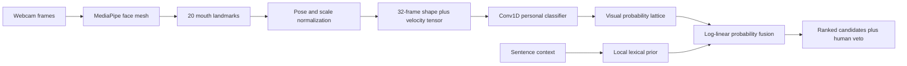

# SHH//TYPE

> Say it. Don't.


SHH//TYPE is a webcam-only silent-word experiment. It tracks the mouth, trains a small temporal neural network on **your** examples, preserves multiple candidate predictions, and lets sentence context rerank them in public.

It is built to demonstrate the interesting part of visual speech recognition: uncertainty. It is not an open-vocabulary transcription system wearing a fashionable interface and a dishonest moustache.

## What the demo does

- Runs locally in a browser on a Mac; no microphone or backend.
- Tracks 20 lip landmarks at interactive frame rates with MediaPipe.
- Normalises translation, scale and in-plane rotation.
- Adds temporal velocity features and resamples every take to 32 frames.
- Trains a TensorFlow.js Conv1D classifier in the browser.
- Stores processed training sequences and model weights in browser storage.
- Shows visual, contextual and fused candidate scores separately.
- Lets the human override the winner instead of hiding uncertainty.

## Run it on macOS

Requirements:

- Node.js 20 or newer
- Chrome or Safari with webcam permission
- Apple Silicon or Intel Mac; Apple Silicon is substantially happier

```bash
git clone https://github.com/madebylukas/shh-type.git
cd shh-type
npm install
npm run dev
```

Open [http://127.0.0.1:5173](http://127.0.0.1:5173). `npm install` copies the MediaPipe WebAssembly runtime and downloads Google's Face Landmarker model into ignored local folders. After installation, the demo can run without a network connection.

## Get a convincing result

1. Enable the webcam and move close enough for **QUALITY / CLEAN** or **FAIR**.
2. Record four takes each of `pat`, `bat`, and `mat`.
3. Begin neutral, mouth the word once, and return to neutral during each 1.9-second capture.
4. Train the local model.
5. Open **02 / DECODE**, mouth one word, and change the context presets.

`pat / bat / mat` are deliberately difficult. Their initial consonants are visually similar, so the candidate lattice should retain uncertainty while context changes the final ordering.

The model is personal. Another person's mouth is distribution shift with teeth.

## Architecture



The browser model is intentionally tiny:

```text
32 frames × 92 features
→ Conv1D(24, kernel 5)
→ batch normalisation + max pooling
→ Conv1D(48, kernel 3)
→ global average pooling
→ dense(64) + dropout
→ softmax over the user's words
```

The context decoder computes a normalised prior and combines it with visual probabilities geometrically:

```text
P(word | video, context)
  ∝ P(word | video)^(1 - λ) × P(word | context)^λ
```

This is the useful version of “let the language model choose what makes sense”: keep the visual evidence alive, tune `λ`, and never let fluent text silently erase what the camera observed.

## Honest scope

This release is a **personalised closed-vocabulary classifier**, not continuous lip-to-text. It proves four product ideas quickly:

1. A commodity webcam can create a delightful silent input loop.
2. Personal calibration is valuable because mouths and speaking styles vary.
3. Ambiguity should be an inspectable lattice, not a single fake certainty.
4. Context can resolve visually similar candidates when it is fused carefully.

For open-vocabulary sentences, swap the classifier for an Auto-AVSR/VALLR-style visual encoder and phoneme decoder. That brings a large model, much more data, slower Mac inference, and error rates that remain far above audio transcription. See [RESEARCH.md](RESEARCH.md) and [IDEATION.md](IDEATION.md).

## Verification

```bash
npm test
npm run build
```

Current checks cover feature invariance, temporal resampling, uncertainty, and contextual reranking. The interface has also been checked at desktop and 390-pixel mobile widths; the live tracker reached 30 FPS on the development Mac.

## Privacy

- `getUserMedia` requests video only: `audio: false`.
- Raw frames are not uploaded or saved.
- Only normalised numerical sequences and model weights persist in browser storage.
- **Reset** removes both.
- No telemetry, accounts or third-party analytics exist.

Inspect the code. Privacy claims should survive `rg`, not merely a gradient landing page.

## Research and next steps

- [Research review](RESEARCH.md)
- [Accuracy and product ideation](IDEATION.md)
- [Launch recipe](LAUNCH.md)

## License

[MIT](LICENSE). MediaPipe and TensorFlow.js retain their respective licenses. The Face Landmarker model is downloaded from Google's official model bucket during installation and is not committed here.
